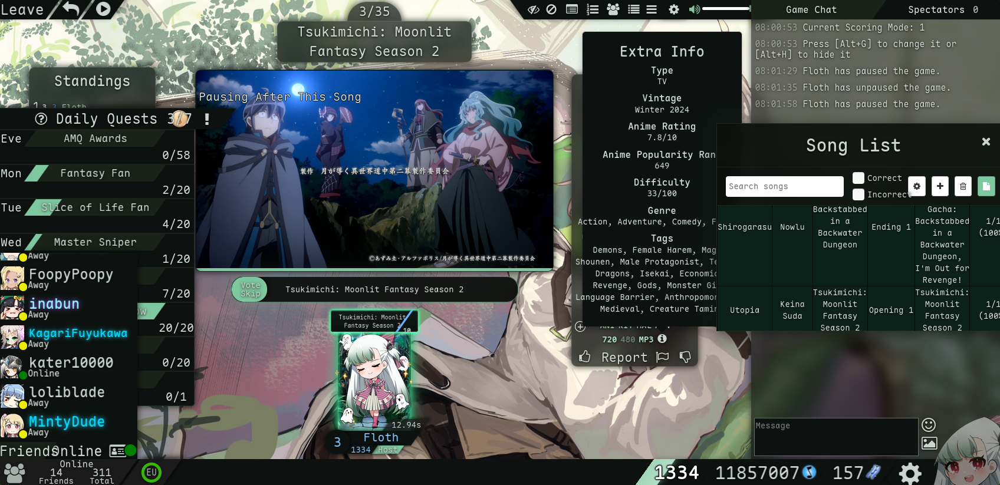

# floth - AMQ Scene

Dark theme for [AnimeMusicQuiz](https://animemusicquiz.com). Palette matched to Scene (Arknights) wallpaper, sage mint + lavender, glassmorphism, [Maple Mono](https://github.com/subframe7536/maple-font).

## Install

**Theme** - requires [Stylus](https://add0n.com/stylus.html)

Open the raw link of `floth-amq-scene.user.css` and Stylus will prompt you to install it.

**Extra Song Info fix** - optional, requires [ViolentMonkey](https://violentmonkey.github.io)

Makes the extra song info popover show above the icon instead of below. Open the raw link of `amq-extrasonginfo-fix.user.js` and ViolentMonkey will prompt you to install it.

## Palette

| Token | Hex | |
|---|---|---|
| `--accentColor` | `#7ec8a0` | sage mint, primary accent, borders, XP bar |
| `--glowColor` | `#c4a8e8` | lavender, particles, waiting state |
| `--primaryColor` | `#0d1210` | base background |
| `--secondaryColor` | `#1a2219` | panel background |
| `--textColor` | `#cbd4ce` | body text |

## Credits

Base structure from [Elodie AMQ Script](https://userstyles.world/style/1435) by melodyelodie.  
Font: [Maple Mono](https://github.com/subframe7536/maple-font) by subframe7536.
